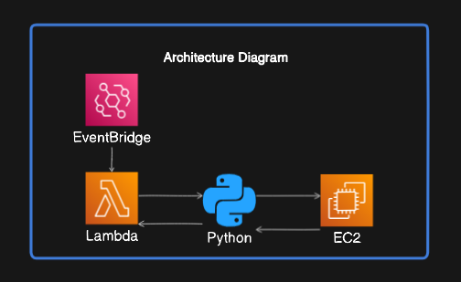
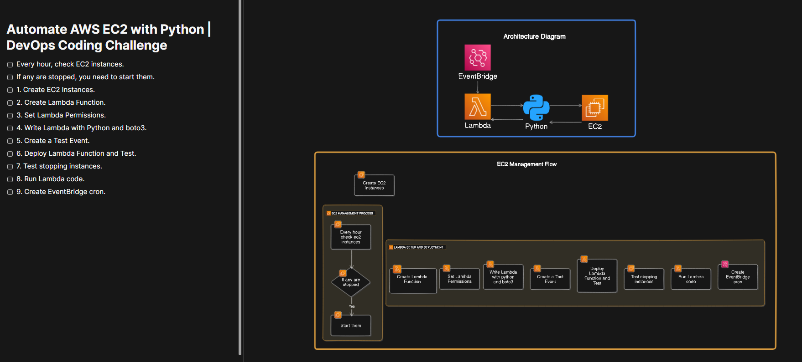

# Automate AWS EC2 with Python | DevOps Coding Challenge

## Overview
The goal is to create a script that checks EC2 instances every hour and starts any stopped instances. This README provides a step-by-step guide to set up and deploy the automation solution.

## Diagram

## To-Do List
- [ ] Every hour, check EC2 instances.
- [ ] If any are stopped, you need to start them.
- [ ] 1. Create EC2 Instances.
- [ ] 2. Create Lambda Function.
- [ ] 3. Set Lambda Permissions.
- [ ] 4. Write Lambda with Python and boto3.
- [ ] 5. Create a Test Event.
- [ ] 6. Deploy Lambda Function and Test.
- [ ] 7. Test stopping instances.
- [ ] 8. Run Lambda code.
- [ ] 9. Create EventBridge cron.

## Additional Information
To complete this project, you'll need:
- An AWS account with appropriate permissions to create and manage EC2 instances, Lambda functions, and IAM roles.
- Python installed on your local machine.
- AWS CLI configured with access to your AWS account.
- Basic knowledge of AWS services and Python programming.

## Step-by-Step Guide
1. **Create EC2 Instances:**
   - Log in to your AWS Management Console.
   - Navigate to the EC2 dashboard.
   - Launch new EC2 instances as needed for your project.

2. **Create Lambda Function:**
   - Go to the Lambda dashboard in the AWS Management Console.
   - Click on "Create function" and choose the appropriate runtime (Python 3.x).
   - Configure your Lambda function settings and permissions.

3. **Set Lambda Permissions:**
   - Ensure that your Lambda function has the necessary permissions to interact with EC2 instances.
   - Create an IAM role with the required policies and attach it to your Lambda function.

4. **Write Lambda with Python and boto3:**
   - Write Python code to check the status of EC2 instances and start them if they are stopped.
   - Use the boto3 library to interact with AWS services within your Lambda function.

5. **Create a Test Event:**
   - Define a test event for your Lambda function to simulate EC2 instance status checks.

6. **Deploy Lambda Function and Test:**
   - Deploy your Lambda function to AWS.
   - Test your Lambda function using the configured test event to ensure it behaves as expected.

7. **Test Stopping Instances:**
   - Manually stop some EC2 instances to verify that your Lambda function correctly identifies and starts them.

8. **Run Lambda Code:**
   - Monitor your Lambda function to ensure it runs periodically (e.g., every hour).

9. **Create EventBridge Cron:**
   - Set up an EventBridge rule (formerly CloudWatch Events) to trigger your Lambda function on a schedule (e.g., every hour).

## Additional Resources

- [Boto3 Resources Documentation](https://boto3.amazonaws.com/v1/documentation/api/latest/guide/resources.html)
- [Using For Loops with Boto3 Collections](https://boto3.amazonaws.com/v1/documentation/api/latest/guide/collections.html)
- [EC2 Instance State Reference](https://boto3.amazonaws.com/v1/documentation/api/latest/reference/services/ec2/instance/state.html)
- [AWS EventBridge Cron Expressions](https://docs.aws.amazon.com/eventbridge/latest/userguide/eb-cron-expressions.html)

## Conclusion
By following these steps, you can automate the management of your AWS EC2 instances using Python and AWS Lambda. This project demonstrates the power of DevOps automation in maintaining a scalable and efficient cloud infrastructure. Feel free to customize and extend the solution to suit your specific requirements. Happy coding!